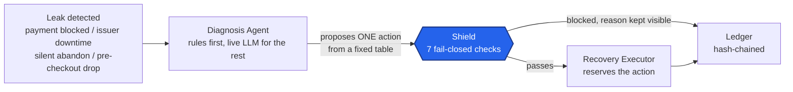

<div align="center">

# Seam

**The revenue leak detective for Shopify + Razorpay.**

Seam joins your Shopify checkout funnel to your Razorpay payment rail,
attributes every lost rupee to a specific cause, and executes bounded,
EV-gated recovery on the leaks worth fixing, behind a deterministic gate a
language model can never talk its way around.

Built for **Razorpay's AI Buildathon 2026, Track 05 (Open).**

**[Live demo →](#)** · [Architecture deep-dive](ARCHITECTURE.md) · [Build log](LEARNINGS.md) · [Quick setup](#get-it-running)

> The backend runs on Render's free tier, which spins down after ~15
> minutes idle, the first request after a gap can take 30 to 60 seconds to
> wake up. If the dashboard looks empty at first, give it a moment and
> reload.

</div>

---

## What it actually does

One sentence a judge should walk away with: **the LLM never touches money
directly.** It only ever gets to propose. A separate, fully deterministic
layer, seven plain checks, zero AI, decides whether that proposal is
allowed to run, and a third layer is the only thing allowed to actually
act on it. Every outcome, blocked or executed, is written to a
tamper-evident, hash-chained ledger.



## See it working

| Feature | What you're actually looking at |
|---|---|
| **Agent fleet, with real run history** | Every agent, click into any one and see its actual recorded runs, each expandable to the real input and output, not a simulated activity count |
| **"Run all agents" sweep** | One click runs detect → diagnose → decide → Shield → intelligence → opportunities, in that dependency order, against real data |
| **Leak map** | Every leak grouped by cause, with a real recoverable-today figure and what share of total leaked value that represents |
| **Recovery queue** | Real proposed actions, split into what's waiting on a human and what's already resolved, blocked actions stay visible with Shield's real reason instead of being hidden |
| **Audit ledger** | Every decision hash-chained from genesis, with a live "verify" that recomputes the whole chain in front of you |
| **Chat with your store** | Ask it a real question about your leaks or open conversations, it can only ever answer from the same tools every other agent uses, there is no send/dispatch tool exposed to it |

## Why this exists

A Shopify store and a Razorpay gateway are two systems that don't know
about each other. The storefront sees shopping behavior, the gateway sees
money moving, and neither one sees both halves of the same customer's
journey. So when a founder loses revenue, both systems answer half the
question: the storefront blames abandonment with no idea those customers
actually tried to pay, and the gateway blames payment failures with no
idea most of the real loss happened before anyone ever reached the
payment screen.

Every "recover my failed payments" tool starts at the payment event,
because that's the half the gateway can see, which makes all of them
blind to the bigger, more common leak. Seam joins the two systems at the
one place they can actually be joined, the checkout itself, classifies
every rupee into a fixed cause, computes whether recovering it is
actually worth the cost of trying, and gates every action behind a
safety layer an AI model has no path to override.

## What makes this different from a typical hackathon agent

Nine things beyond the baseline, each a real, running feature:

1. **A real agent harness, not a simulated activity feed**: every agent run, deterministic or LLM-assisted, writes a real row with its actual input, output, status, and duration. Click into any agent and see exactly what it did, not a count that goes up.
2. **A live prompt-injection defense, tested against a real model**: all 7 adversarial fixtures plus a plain benign case correctly classified by a real, live Groq call, not just asserted against a mock.
3. **Honest about where it stops**: the Recovery Executor runs the real decide() plus Shield pipeline and creates real, reserved recovery actions, then discloses precisely why it stops short of dispatching (no connected Razorpay credential in this build) instead of quietly faking a send.
4. **Blocked actions never disappear**: a Shield block renders with its exact real reason on the recovery queue, hiding it would defeat the entire point of having a gate.
5. **A ledger you can verify live, not just claim is tamper-evident**: hit verify and watch the whole hash chain recompute from genesis in the running app.
6. **A join engine that admits what it doesn't know**: the scored fallback lands genuinely ambiguous matches in a "don't guess" band rather than forcing a join, precision 1.000, recall 0.333, with the recall gap fully broken down rather than hidden behind one headline number.
7. **A demo dataset produced by the real pipeline**: the seed script runs the actual detect → diagnose → decide → Shield → reserve chain over generated data, it does not hand-insert rows to fake what the system does.
8. **A "Run all agents" sweep with real dependency ordering**: one click, real work at every step, in the order each step actually depends on the last.
9. **A chat agent that structurally cannot act**: every tool it has is read-only, so "ask your store a question" can never become "an LLM sent a message," by construction, not by a prompt telling it not to.

## Architecture


Ingest is HMAC-verified webhooks landing in a Postgres queue. A join
engine attaches every Razorpay payment to the Shopify checkout it belongs
to, deterministically where the checkout ID survives in Razorpay's own
payment notes, or through a scored fallback (email, phone, amount,
timestamp) where it doesn't. From there, one shared agent harness runs
every worker in the fleet, detection and diagnosis feed policy, policy
feeds Shield, Shield gates the executor, and every real outcome lands in
both Postgres and the hash-chained ledger. Full request-flow walkthrough
and data model: **[ARCHITECTURE.md](ARCHITECTURE.md)**.

## Shield, the gate an LLM cannot override

Seven ordered, fail-closed checks stand between any proposed action and a
real customer. An exception thrown by any check becomes a block, never a
pass, proven directly by a test, not assumed from a try/catch existing.

| Check | What it actually enforces |
|---|---|
| Opt-out | A customer who has ever said stop is blocked, permanently, checked before every future contact |
| Quiet hours | No contact between 21:00 and 09:00 IST, deferred, never sent |
| Contact frequency cap | No more than 2 contacts to the same customer in a rolling 7 days |
| Recovery floor | Nothing under ₹200 is worth the cost of contacting |
| Merchant daily outreach cap | A hard ceiling on how many messages go out for one merchant per day |
| Message content check | The templated message itself may never contain a digit or a URL, those are only ever appended by the system, never authored by anything upstream |
| EV threshold | Anything above the auto-approve threshold routes to a human for approval instead of auto-sending, regardless of how confident the diagnosis was |

## Proof, not claims

- **Leak detection: precision 1.000, recall 1.000** on all four detectable classes, 43/43 planted leaks found exactly, on both the dev and a held-out seeded set opened exactly once (timestamped in `NOTES.md`).
- **Join engine, scored fallback: precision 1.000** (never once joins the wrong checkout), **recall 0.333**, and that number is explained, not hidden, a third of real matches are correctly accepted, a third are correctly held in an ambiguous "don't guess" band, and a third are correctly declined outright.
- **Against `blast_everything`** (message every detected leak, no gating): Seam's own eval runs disclose ties or a trailing net on immediately-auto-dispatched value, and both times the entire gap traces to Shield correctly holding back a specific action, one to a human, one below the profitability floor, that the naive strategy would have fired blindly. Full breakdown, not a smoothed-over win: [`EVALUATION.md`](EVALUATION.md).
- **305 tests, all against a real Postgres instance**, not a mocked database, `pnpm test` from `apps/api`.
- **Real bugs, found and fixed, logged as they happened**: a stale Prisma client after a schema change, a "tamper" test that wasn't actually tampering because of lenient base64 decoding, an AI SDK whose real interface had moved since any documentation was written, a live model integration that failed because a schema-conversion bug leaked an internal marker into what was sent over the wire, and a "deterministic" seed script that produced different results on identical reruns because of one stale, un-scoped database row. Every one of these, with the actual root cause, is in [`LEARNINGS.md`](LEARNINGS.md).

## Tech stack

| Layer | Choice |
|---|---|
| Backend | Hono + TypeScript + Prisma 7, Postgres |
| Frontend | Next.js (App Router) + TypeScript, Tailwind |
| Diagnosis LLM | Groq, schema-constrained structured output |
| Chat agent LLM | OpenRouter, tool-calling |
| Orchestration | LangGraph.js, for the one subgraph that actually needs checkpointed, crash-resumable state |
| Database | Postgres (Neon in production) |
| Payments | Razorpay Test Mode API, real key verification and payment link creation |
| Hosting | Vercel (frontend), Render free tier (backend) |

## Get it running

```bash
git clone https://github.com/WebDevAmey/seam.git
cd seam
pnpm install

# apps/api
cd apps/api
cp .env.example .env    # fill in DATABASE_URL, DATASOURCE_ENC_KEY, JWT_SECRET
pnpm db:push             # schema + Prisma client, one step
psql "$DATABASE_URL" -f prisma/manual-constraints.sql
pnpm test                 # 305 tests, all deterministic, no LLM key needed
pnpm exec tsx --env-file=.env scripts/seed-demo.ts   # real demo data, prints its login
pnpm dev                   # http://localhost:8090
```

```bash
# apps/web, in a second terminal
cd apps/web
pnpm dev                    # http://localhost:3000
```

`GROQ_API_KEY` (live diagnosis escalation) and `OPENROUTER_API_KEY` (chat)
are both optional, everything else runs with no key at all, and each
degrades to a clear, disclosed message instead of failing silently
without one. Full deployment runbook: [`DEPLOYMENT.md`](DEPLOYMENT.md).

## Repo layout

```
seam/
├── README.md
├── ARCHITECTURE.md        # full technical walkthrough
├── LEARNINGS.md           # the running build log, real bugs, real fixes
├── LIMITATIONS.md         # every disclosed gap, quantified where possible
├── DECISIONS.md           # real decisions, with the real alternatives
├── EVALUATION.md          # pre-registered eval methodology and results
├── DEPLOYMENT.md          # the real deploy runbook
├── docs/architecture.png
├── apps/api/src/
│   ├── agents/              # the registry, the harness, every live agent
│   ├── diagnosis/            # rules first, LangGraph + Groq for the rest
│   ├── policy/                 # decide(): diagnosis → action + EV
│   ├── shield/                   # the 7-check gate
│   ├── execute/                    # reserve → dispatch → record
│   ├── ledger/                       # the hash-chained audit trail
│   ├── join/, resolve/                 # the checkout↔payment join engine
│   └── leaks/, intelligence/             # detection + method-concentration
└── apps/web/
    ├── app/(app)/recovery/       # the whole authenticated console
    └── app/page.tsx              # the public landing page
```

## Status & known limits

Disclosed, not hidden, full detail in [`LIMITATIONS.md`](LIMITATIONS.md):

- "Net rupees recovered" is predicted expected value, not realised recovery, there's no outcome worker in this build tracking whether a payment actually came back in.
- The Recovery Executor reserves real actions and records real Shield verdicts, but stops short of actually dispatching, since no merchant in this build has a connected Razorpay credential.
- WhatsApp and SMS are simulated at the transport layer only, everything downstream of "here is the reply text," classification, ticketing, opt-outs, is real.
- One leak class in the taxonomy (post-purchase refunds/returns) has no detector yet, it needs a data model this schema doesn't have.
- Render's free tier cold-starts after ~15 minutes idle, mitigated by a keep-warm cron, not eliminated.

## What to read next

- **[ARCHITECTURE.md](ARCHITECTURE.md)**: the full technical walkthrough
- **[LEARNINGS.md](LEARNINGS.md)**: the build log, written as it happened
- **[LIMITATIONS.md](LIMITATIONS.md)**: every known gap, quantified
- **[EVALUATION.md](EVALUATION.md)**: the pre-registered eval and its results
